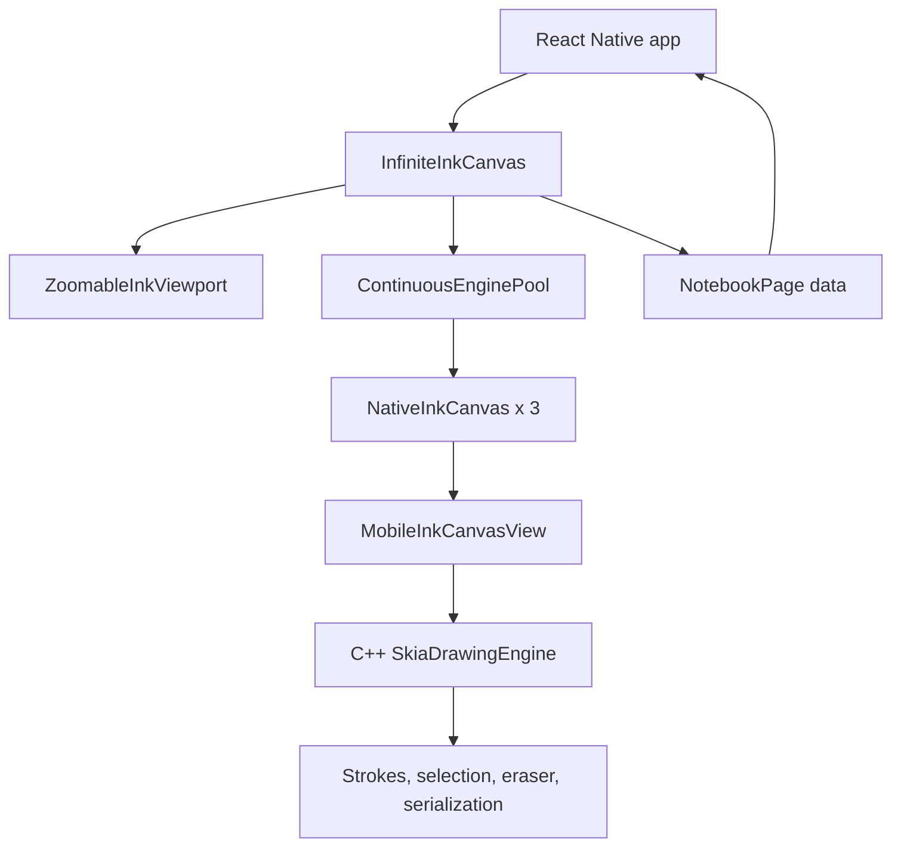

# Architecture

`@mathnotes/mobile-ink` is organized around one idea: keep native drawing engines stable and move page assignment around them, instead of mounting and destroying heavy native canvases while the user scrolls.



## Layers

### React Native primitives

- `NativeInkCanvas` wraps the native view and bridge commands.
- `ZoomableInkViewport` owns pinch zoom, focal-point math, momentum scroll, bounds, and Pencil/finger gesture routing.
- `ContinuousEnginePool` keeps a fixed number of native canvases mounted and reassigns them to pages.
- `InfiniteInkCanvas` composes the viewport and pool into a generic continuous notebook shell.

### Native bridges

- iOS `MobileInkCanvasView` is the Metal-backed native drawing surface.
- Android `MobileInkCanvasView` is a `GLSurfaceView` that renders the shared C++ engine into an OpenGL texture.
- `MobileInkCanvasViewManager` exposes React Native props and commands on both platforms.
- `MobileInkBridge` exposes iOS helpers that are not tied to a single view, including notebook parsing and continuous-window compose/decompose.
- `MobileInkModule` exposes Android promise-based drawing persistence and batch export helpers.
- `MobileInkBackgroundView` renders generic page backgrounds on iOS; Android backgrounds are rendered by the shared Skia engine inside the canvas.

### C++ Skia engine

The C++ layer owns high-frequency drawing behavior: active stroke rendering, path rendering, erasing, stroke splitting, selection, serialization, and batch export. Keeping this logic below the JS bridge is what makes Pencil latency and page-scale notebooks practical.

## Continuous Canvas Model

`InfiniteInkCanvas` keeps one trailing blank page after the last page with content. When the user writes on the trailing blank page, the package appends one new blank page. It does not preallocate a long stack of blank pages.

`ContinuousEnginePool` defaults to three engines. During viewport movement, the transform stays on the UI thread. When motion settles, the pool assigns engines around the settled page. Dirty pages are serialized before a pooled engine is reused for another page.

## Serialization

A `SerializedNotebookData` payload is plain JSON:

```ts
type SerializedNotebookData = {
  version: '1.0';
  pages: NotebookPage[];
  originalCanvasWidth?: number;
};
```

Consumers own storage and decide how serialized notebook payloads move through their app.

## Native Memory Lifecycle

The pool reuses native views for page changes. Heavy native state is released only on final unmount through `releaseEngine` where the platform needs explicit teardown, which prevents scroll-driven native-view churn and keeps allocations flat during repeated page crossing.
